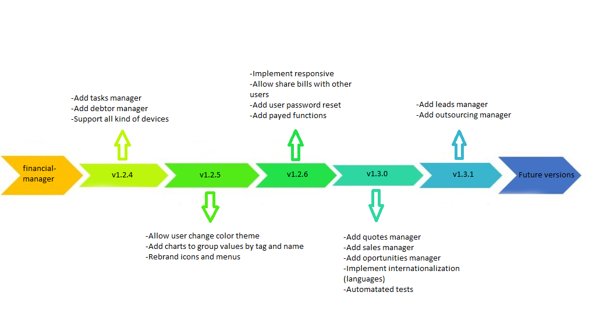

## Status

|  Dev environment | Stg environment | Prd environment |
|:----------------:|:--------------:|:---------------:|
| N/A | [](https://github.com/BIEMAX/financial-manager-app/actions/workflows/firebase-deploy.yml) | [](https://github.com/BIEMAX/financial-manager-app/actions/workflows/firebase-deploy.yml) |


# Introduction

This project is a frontend software for [financial-manager-api](https://github.com/BIEMAX/financial-manager-api), 
that consists in:

- Manage your personal and professional costs
- Control bills close to overdue ou already overdue
- View your money (spend, save and remaining) in charts

If you want to test it, you can access our demo accessing the link [financial-manager-staging.web.app](https://financial-manager-staging.web.app).

Some features that this application have:
- Automatic deploys via Heroku
- Code quality and tests
- CI/CD for staging and production environments


# Available languages

Currently, we only have support to *portuguese*, but we're of necessity of implement other languages.


# Roadmap




# Requirements

1. [Financial-manager-api](https://github.com/BIEMAX/financial-manager-api) running on your machine
2. MongoDB connection (set in configuration file in `financial-manager-api`)
3. Web or mobile device


# How to run in localhost

1. Create following files in folder `src/environments`:
- environment.dev.ts
- environment.ts

> **Note:** Don't commit changes in these files, or this will break our pipelines.

2. Configure the files created before with the following content:
```typescript
export const environment = {
  production: false,
  applicationName: 'Financial Manager',
  //Version to show in title
  applicationVersion: 'v1.2.5',
  //Your backend url (without slash at the end)
  apiUrl: 'http://localhost:8080',
  //Version of your endpoints (without slash at the end)
  apiVersion: 'v1',
  //Field 'secret' from 'Authorization' collection in MongoDB
  apiSecret: '<YOUR_API_SECRET>',
  //Field 'clientId' from 'Authorization' collection in MongoDB
  apiClientId: '<YOUR_CLIENT_ID>',
  //True to log all errors/exceptions in browser console.
  logInfo: true,
};

/**
 * The colors can be: primary (purple), accent (pink) or warn (orange).
 */
export const ui = {
  color: "primary",
};

/**
 * Default user to login (for tests only)
 */
export const user = {
  login: '<DEFAULT_USER>',
  password: '<DEFAULT_PASSWORD>'
}
```

> **Note:** The 'apiSecret' parameter is used to new users registration
> and the 'apiClientId' parameter is used to other endpoints.

3. After create configuration files, we need to install dependencies:
```bash
npm install
```

4. To run the project in you can run with the following commands:
```bash
# run in localhost (localhost:4200)
npm run dev

# run with staging settings
npm run stg

# run with production settings
npm run prd

# Or, if you want to test with your mobile device in your network, run:
npm run lan
```

5. Access the web app in your browser with the following link:

```bash
http://localhost:4200
```

6. Some variables that are stored in localStorage:
```javascript
localStorage.getItem('userBearerKey');
localStorage.getItem('userLogin');
localStorage.getItem('userName');
localStorage.getItem('userSecret');
localStorage.getItem('keepUserConnected');
localStorage.getItem('isDarkModeEnable')
```

## Common problems

1. > **Note:** If you are having issues to run, install these other packages separately:

```bash
npm i @angular-devkit/build-angular

npm i @ngtools/webpack

npm i mini-css-extract-plugin

npm i postcss-loader

# For 'ngx-markdown' dependency
npm install --save @types/marked
```

2. > **Note 2:** If you are getting the error `Unknown version 109 of chrome`, just run in your terminal:
```bash
npx browserslist --update-db
```

3. Certified that you are using `node v18.x.x version or high` and `npm 8.19.x version or high`.