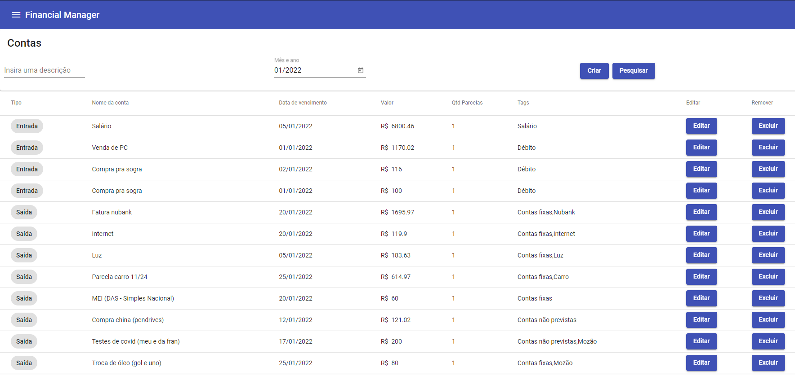
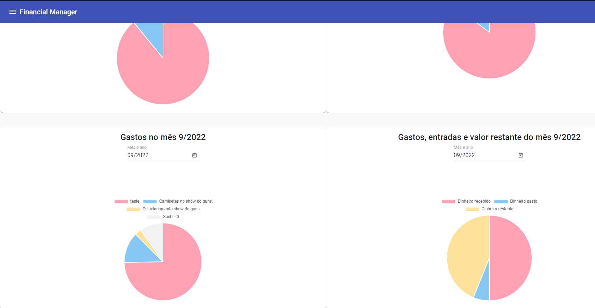

# Financial Manager App

Project to controls personal/professional costs and receives.

You can create future bills, control receive salary, spent and remaining money from month or per year.

# System requeriments

| O.S.   | Node Version      |  Supported |
|----------|:-------------:|------:|
| Windows 7 |  Unsupported | :x: |
| Windows 10 |  v14.18.x | - [x] Supported |
| Windows 11 |  v14.18.x  | - [x] Supported |
| Linux (Ubuntu) | v16.17.x | - [x] Supported |
| col 3 is | right-aligned | - [x] Supported |

# Bills screen

# Reports/Charts screen

