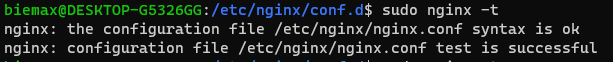
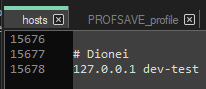
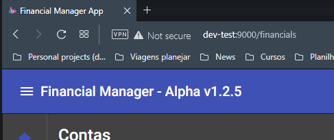

## How to host your build in WSL (Windows Subsystem for Linux)

1. First, we need to run your build with the command:
```bash
npm run build-<YOUR_ENVIRONMENT_HERE>

#Example
npm run build-hml
```

2. After that, download and install the WSL. Choose DISTRO that you is more comfortable for work. In this guide, we'll use the DISTRO Linux Ubuntu LTS.

3. Create a folder to host your builded project. In this guide, we create the folder in `/prj/dist`. You can create wherever you want.

4. Give permissions to folder with the command `sudo chmod a+rwx /prj/dist`

5. Install Nginx through `sudo apt update && sudo apt upgrade && sudo apt install nginx`

6. Validate if the Nginx install successfully running the command `sudo systemctl status nginx`

7. We need configure the host in Nginx. Navigate to folder `/etc/nginx/config.d/`.

8. After enter in the folder above, we need create a file to configure our project. In this guide, we'll create a file called `fmapp.conf`(you can call it wharever you want) with the command:
```bash
sudo nano fmapp.conf
```

9. In the file content, we'll put the following definitions:
```yaml
server {
  listen 9000;          #Your server port
  server_name dev-test; #Server name that we'll connect later with windows
  root /prj/dist;       #Folder with our build project
  location / {
    try_files $uri $uri/ /index.html;
  }
}
```

10. After defined the basic settings, restart Nginx with the command `sudo systemctl restart nginx`. After, check if the Nginx is running with the command `sudo systemctl status nginx`.

11. We need validate if our config file is ok. To do that, run the command `sudo nginx -t`.


12. We need add the host that we configure on step `9` in `windows host file`. Run the command above with administrator permission to edit it.
```bash
%windir%\system32\drivers\etc\hosts
```

13. Add at the end of the file, the address `127.0.0.1 dev-test` and save it.



14. If we did it everything correct, we just need to copy our builded folder to linux folder (example above).
```bash
# Navigate to our directory in windows with our project
cd /mnt/e/code/custom/financial-manager-app

# Copy folder to linux folder
# cp SOURCE DESTINATION -RECURSIVE
cp dist /prj/dist -r
```

15. Restart the Nginx and access in your windows system, the following link:
[http://dev-test:9000/](http://dev-test:9000/)

